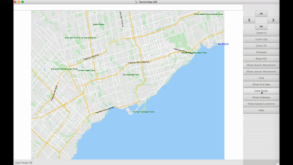

# MyTour
A GIS navigation software aimed towards tourists.

Designed a mapping GIS in C++ catered specifically towards tourists using data procured from OpenStreetMaps. Used the GTK graphics package to create an interactive UI. 
* The software visualizes the data very similar to how Google Maps displays streets, buildings, parks, and different natural features using parsed data. 
* The software allows the user to find the shortest route between two destinations using the A* algorithm. It also solves a variation of the travelling salesman problem where the software computes the best possible route. 
* Users can choose to load a map from a large list of cities. They could see different Points of Interest, Tourist and Leisure locations, and click to get information on them. 
* Users can interact (pan, zoom, highlight, search for locations, etc.) with the UI.

## Demo of MyTour

This demo shows how the application can be used to help users plan their trip to the city of Toronto.

### Zoom and Shift Map

Users have the ability to easily zoom and move the map to explore a new city

### Show Physical Features

Users can click to see physical features which are filtered out to optimize usability, due to the fact that tourists new to an area can be overwhelemed and bombarded with new information. These features include but are not at all limited to;

#### Points of Interest (POI)

#### Subways

### Finding Options

The UI gives the user the opportunity to search for and find various things. These include but are not limited to;

#### Finding Streets

Users can search for streets in a city. The software can ignore any minor spelling mistakes inputted and still correctly find the correct street.

#### Finding Points of Interest (POI)

Users can search for POI in a city. The software can ignore any minor spelling mistakes inputted and still correctly find the correct POI.

#### Finding Paths

Users have the ability to use the UI to find the shortest path between two points using the A* path-find algorithm. Users have 2 options;

##### Click on the starting and ending intersections:

##### Type the four street names that define the starting and ending intersections:

### Dark Mode

Users can almost instantaneously switch into dark mode if they prefer darker colours.

The user also has the option of saving locations and coming back to them later.
